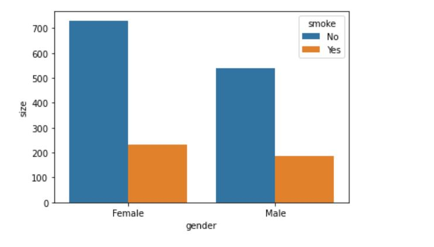
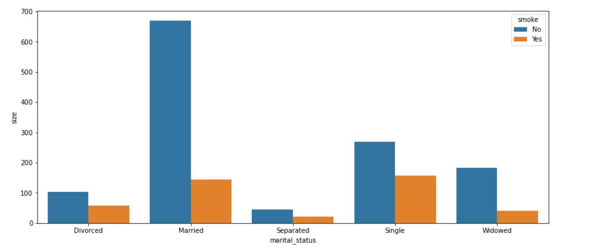
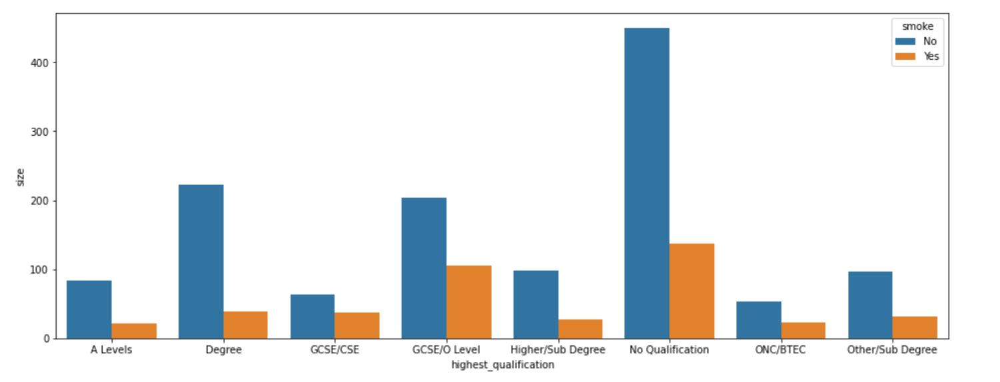
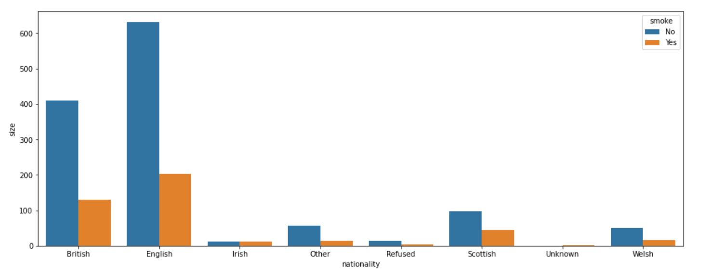
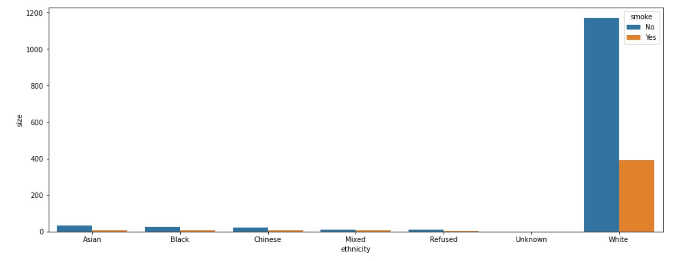
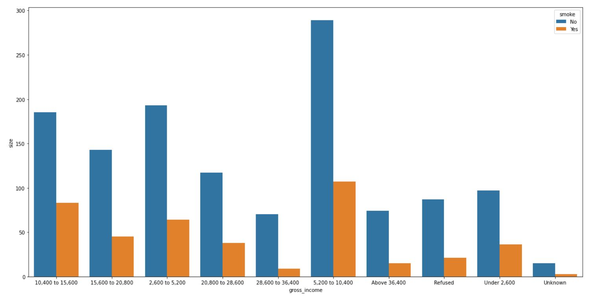
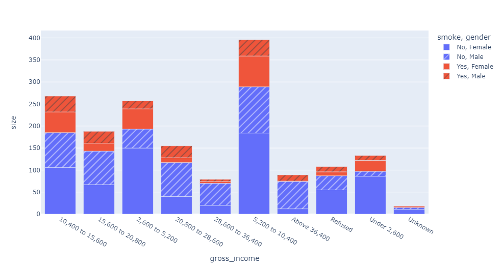
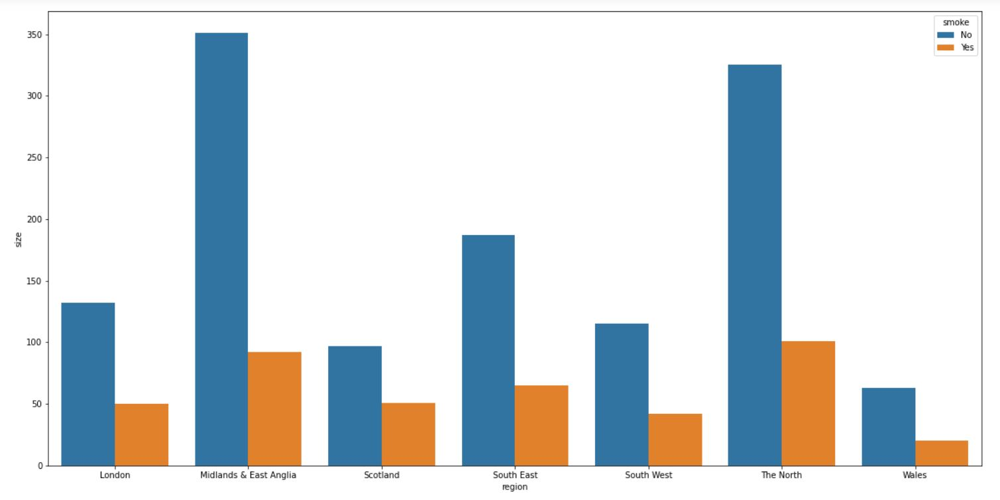
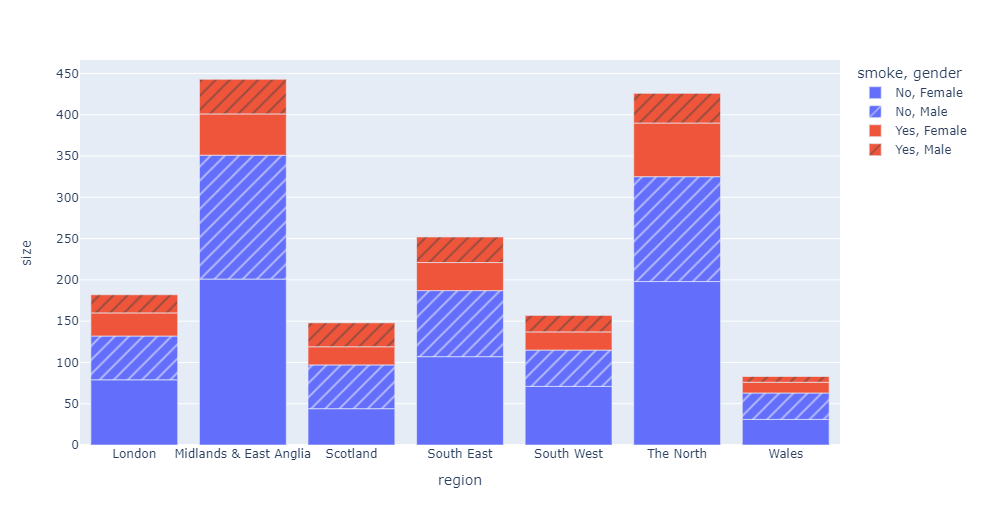
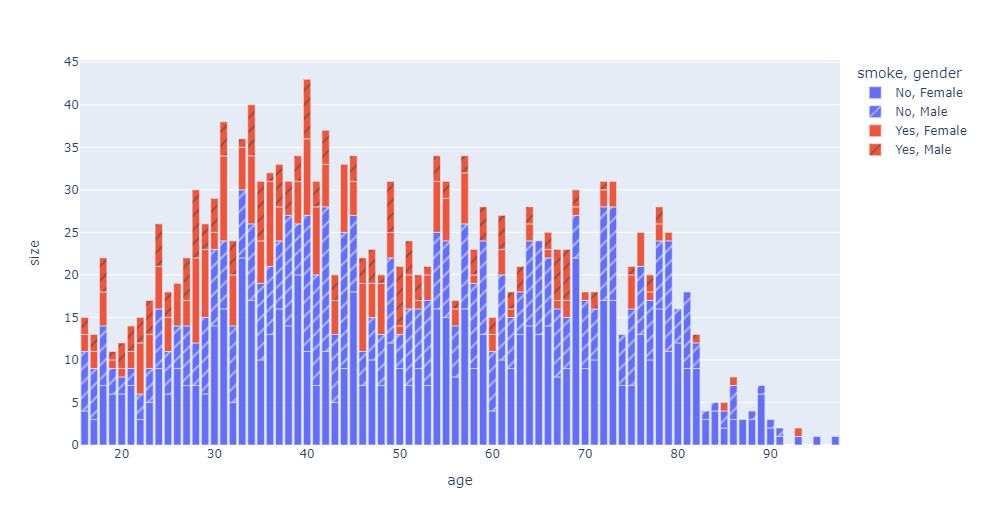

# Smoking Habit Analysis

---

### Introduction
This is a project on  analyzing smoking habit in united kingodm. The  dataset contain Survey data on smoking habits from the United Kingdom. The data set can be used for analyzing the demographic characteristics of smokers and types of tobacco consumed. A data frame with 1691 observations on the following 12 variables; gender,	age,	marital_status,	highest_qualification,	nationality,	ethnicity,	gross_income,	region,	smoke,	amt_weekends,	amt_weekdays,	type.

Data Source: The data was sourced from Kaggle

### Problem Statement
1. investigate smoking habit based on gender
2. investigate smoking habit based on marital status
3. investigate smoking habit based on education level
4. investigate smoking habit based on nationality
5. investigate smoking habit based on ethnicity
6. investigate smoking habit based on gross income
7. investigate smoking habit based on region
8. investigate smoking habit based on age

### Concept demonstrated:1

The data set was analyse using python and the following process was incorporated:
1. importing the data set into the jupiter environment
2. data cleaning
3. Explorative Data analysis

### Data Analysis:

1. Analyze smoking habit based on gender

The chart indicate that there is no much significant difference in smoking habit based on gender

---

2. Analyze  smoking habit based on marital status

- The analysis indicate that both married and single marrital status have a significant frequency of smoker than every other group
- The divorse status also shows a spike of average of those that say yes to smoking based on sample collected.
- The proportion of the single group that smoke is significant in numbers and proportion to those that say no
---

3. Analyze  smoking habit based on education level

- The chart above shows that two group with lower education qualification(GCE/O Level & NO Qualification) have the highest number of smokers
---

4. Analyze smoking habit based on nationality

- The British and English shows significant higher number of smokers compare to other nationality

---
5. Analyze  smoking habit based on ethnicity

- The analysis shows that the white have a significant frequency of smokers compare to every other ethnicity

---

6. Analyze  smoking habit based on gross income

- The analysis indicate that the proportion of group of workers (Above 36400, 28600 to 36400) with the highest pay have a lower frequency of smokers compare to those below 
  the highest pay

---

7. Analyze  smoking habit based on region

- The analysis indicate that each region show a significant level of smokers where Wales have the lowest and The North and Midlands & East Anglia show more significant 
  value of smokers

- Based on this analysis the frequency of female smokers across the region is more than that of the male

---

8. Analyzing smoking habit based on Age and gender

-The analysis indicate that older aged frequency of smokers are less compare to the younger age irrespective of the gender

---

### Conclusion:
- based on the dataset, the analysis indicate that both gender significantly have smoking habit but the female is slightly more than the male
- Analysis indicate that lower earners and those with no to lower education qualification possess more smoking habit to others
- lower age group play a significant frequency of those with smoking habit compare to the older age
- The british and the English shows a significant frequency of smokers to all others and the nationality also shows that the white are the major smokers
